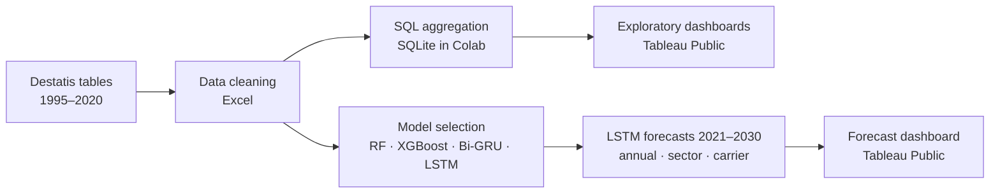

# Energy Consumption Forecasting in Germany Using Machine Learning

Forecasting Germany's energy use up to 2030, in total, by sector and by energy carrier, using 26 years of official Destatis data, SQL, Tableau and LSTM neural networks.


**MSc Data Analytics dissertation** · Berlin School of Business and Innovation (BSBI) · 2025  
*Forecasting Germany's Energy Consumption Trends Using Machine Learning: Sectoral and Carrier-Specific Analyses up to 2030*

## Overview

Planning Germany's energy transition (Energiewende) needs long-term demand forecasts that go beyond national totals. Most earlier work looked at aggregate or short-term consumption, so this project analyzes energy use from 1995 to 2020 across Germany's production branches and energy carriers, then forecasts annual, sector-level and carrier-level demand for 2021 to 2030.

**Research questions**

1. How did energy consumption develop across sectors in Germany from 1995 to 2020?
2. Which factors drive consumption, and how do they differ by sector and energy carrier?
3. How accurately can machine learning models forecast consumption up to 2030 from historical data?
4. How has renewable energy use evolved compared with non-renewable sources, and what does that mean for future demand?

## Data

Two public tables from the German Federal Statistical Office (Destatis, GENESIS-Online), both covering 1995–2020 in terajoules (TJ):

| Table | Content |
|---|---|
| [85121-0001](https://www-genesis.destatis.de/datenbank/online/statistic/85121/table/85121-0001) | Energy consumption of homogeneous branches |
| [85121-0002](https://www-genesis.destatis.de/datenbank/online/statistic/85121/table/85121-0002) | Energy use of each branch by energy carrier (coal, oil products, gases, electricity, renewables and others) |

The raw tables were cleaned in Excel: duplicates removed, "-" placeholders set to 0, flagged text entries dropped, branch and carrier names standardized, and outliers handled with the IQR method.

## Approach



1. **SQL (SQLite in Colab).** The cleaned tables are loaded into a database, reshaped from wide to long format, and aggregated into yearly totals, totals per carrier and each carrier's share of total use.
2. **Exploratory analysis (Tableau Public).** Dashboards show trends over time, sector rankings and the carrier mix.
3. **Model selection.** Random Forest, XGBoost, Bi-GRU and LSTM were tested and evaluated with MSE, RMSE, MAE and MAPE on chronological train/test splits. The development notebook engineers lag features (1 to 3 years) and 3- and 5-year rolling means. LSTM was chosen for the final forecasts because it captures long-term dependencies well and came out ahead in the thesis comparison.
4. **Forecasting.** Three notebooks train stacked LSTM networks and forecast 2021–2030 recursively, feeding each prediction back in as input for the next year.

| Notebook | Forecast target | Network |
|---|---|---|
| `Annual_Energy_Consumption_Forecast` | Total annual energy use | LSTM(64) → LSTM(32) → Dense(16) → 1 output |
| `Sector_Wise_Energy_Forecast_` | Top 6 sectors | LSTM(128) → LSTM(64) → Dense(32) → 6 outputs |
| `Energy_Carrier_Wise_Forecast` | All 12 energy carriers | LSTM(128) → LSTM(64) → Dense(32) → 12 outputs |

All three use a 5-year input window, min-max scaling, 0.2 dropout after each LSTM layer, the Adam optimizer, MSE loss, 100 epochs and a batch size of 32. Forecasts are exported to Excel and visualized in Tableau.

The top 6 sectors by total consumption are electricity, gas, steam and air conditioning; coke and refined petroleum products; chemicals; basic metals; air transport; and other non-metallic mineral products.

## Key findings

- Total energy use fluctuated over the period, with the clearest swings between 2008 and 2011 and the lowest level in 2020. All six of the largest consumers are energy, manufacturing or transport branches.
- Renewable energies grew almost ninefold, from about 1% of total use in 1995 to about 10% in 2020. Over the same period hard coal fell 56% and lignite 43%, while gas use rose 57%.
- The transition is uneven. Services and commercial activities adopted renewables fastest, energy-intensive industries with high-temperature processes lag behind, and transport still runs mainly on diesel and petrol.
- The annual LSTM projects total energy use leveling off at roughly 17,100 to 17,500 PJ per year through 2030.

### Reality check: forecast vs. published figures

| Year | LSTM forecast (PJ) | Published figure (PJ) |
|---|---:|---:|
| 2021 | 17,470 | 15,935 |
| 2022 | 17,301 | 15,421 |
| 2023 | 17,159 | 14,905 |

<sub>Published figures: AG Energiebilanzen (2024), as cited in the thesis.</sub>

The forecasts ran roughly 10 to 15% above the published figures. The thesis attributes this to factors a model trained only on past consumption cannot see: the post-COVID economy, faster than expected policy changes such as earlier coal plant closures and new renewable incentives, and efficiency gains from new technology. This gap is the main argument for the hybrid approach listed under next steps.

## Interactive dashboards

Built in Tableau Public:

- [Energy Consumption Overview](https://public.tableau.com/views/EnergyConsumptionOverview_17381460669580/EnergyConsumptionOverview)
- [Energy Usage by Sector and Carrier](https://public.tableau.com/views/EnergyUsagebySectorandCarrier/EnergyUsagebySectorandCarrier)
- [Germany's Energy Consumption Forecast 1995–2030](https://public.tableau.com/views/EnergyConsumptionForecastinGermany1995-2030/GermanysEnergyConsumptionForecast1995-2030)
- [Renewable vs. Non-Renewable Energy Trends](https://public.tableau.com/views/RenewablevsNon-RenewableEnergyTrends/RenewablevsNon-RenewableEnergyTrends)

## Repository contents

| File | Description |
|---|---|
| `Use of Energy of Energy Carriers.csv` | Cleaned Destatis data (48 branches × 12 carriers, 1995–2020, TJ), input for the forecast notebooks |
| `SQL_Queries.ipynb` | SQLite database and aggregation queries |
| `total_year.csv`, `total_carriers.csv`, `contribution_percentage.csv` | SQL outputs used as Tableau data sources |
| `energy_carriers_forecast.csv` / `.xlsx` | Yearly totals for 1995–2020 in wide format: 12 carriers, top 6 sectors and overall use |
| `LSTM_Model_Development.ipynb` | Model comparison and LSTM tuning |
| `Model_Implementation_Attempt_1.ipynb` to `_6.ipynb` | Earlier modeling iterations with tree ensembles, gradient boosting and recurrent networks |
| `Annual_Energy_Consumption_Forecast.ipynb` | Final annual forecast |
| `Sector_Wise_Energy_Forecast_.ipynb` | Final sector forecast |
| `Energy_Carrier_Wise_Forecast.ipynb` | Final carrier forecast |

## How to run

The three forecast notebooks run as they are in Google Colab and pull the data directly from GitHub:

| Notebook | |
|---|---|
| Annual forecast | [](https://colab.research.google.com/github/Sajithpemarathna/Energy-Consumption-Forecasting-in-Germany-Using-Machine-Learning/blob/main/Annual_Energy_Consumption_Forecast.ipynb) |
| Sector forecast | [](https://colab.research.google.com/github/Sajithpemarathna/Energy-Consumption-Forecasting-in-Germany-Using-Machine-Learning/blob/main/Sector_Wise_Energy_Forecast_.ipynb) |
| Carrier forecast | [](https://colab.research.google.com/github/Sajithpemarathna/Energy-Consumption-Forecasting-in-Germany-Using-Machine-Learning/blob/main/Energy_Carrier_Wise_Forecast.ipynb) |

To run them locally:

```bash
git clone https://github.com/Sajithpemarathna/Energy-Consumption-Forecasting-in-Germany-Using-Machine-Learning.git
cd Energy-Consumption-Forecasting-in-Germany-Using-Machine-Learning
pip install pandas numpy scikit-learn tensorflow xgboost matplotlib seaborn openpyxl jupyter
jupyter notebook
```

`SQL_Queries.ipynb` expects the two cleaned Excel tables to be uploaded to the session first, and parts of the development notebooks read intermediate files that are not included here, so those notebooks document the modeling process rather than run end to end. LSTM training is not seeded, so forecasts change from run to run.

## Limitations and next steps

- Each series has only 26 yearly data points, which limits what any model can learn.
- The models see consumption history only. Economic indicators (GDP, inflation, trade), policy changes and climate variables are not included.
- Proposed next steps: hybrid models that combine machine learning with econometric and policy data, scenario-based forecasts (best case, worst case, business as usual) and real-time data feeds.

## Author

**Sajith Pemarathna** · [GitHub](https://github.com/Sajithpemarathna) · [Tableau Public](https://public.tableau.com/app/profile/sajith.pemarathna)

Data source: Statistisches Bundesamt (Destatis), GENESIS-Online, tables 85121-0001 and 85121-0002.
